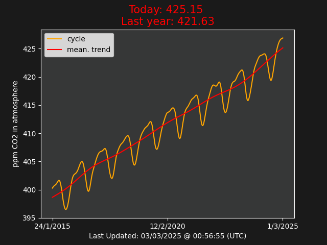

# A graph showing the the avarage amounts of CO2 in the atmosphere 
 ## measured by four NOAA observatories based in: 
 * Barrow, Alaska 
* Mauna Loa, Hawaii 
* American Samoa  
* South Pole, Antarctica 
 shoutout to agentphantom for the idea!